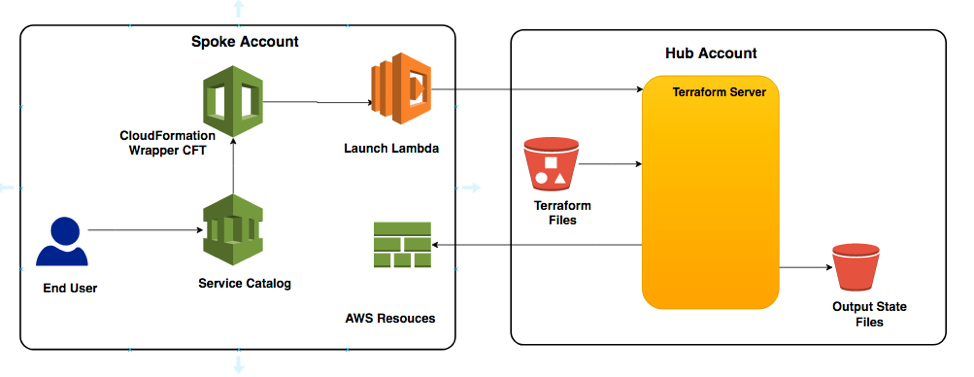
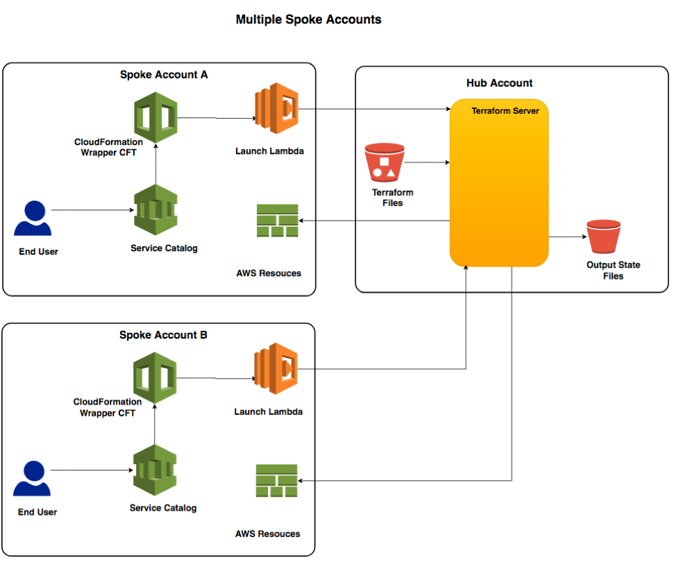
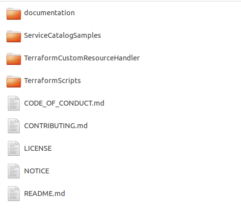
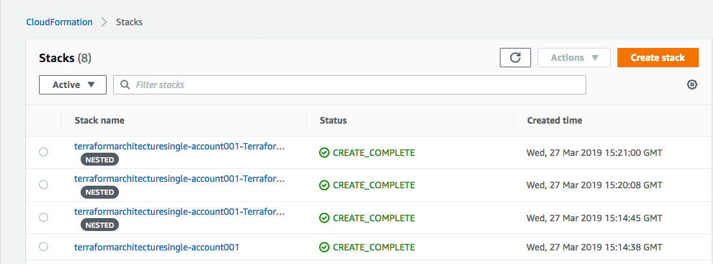
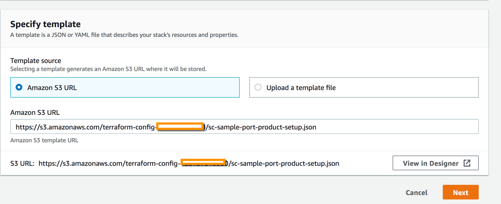
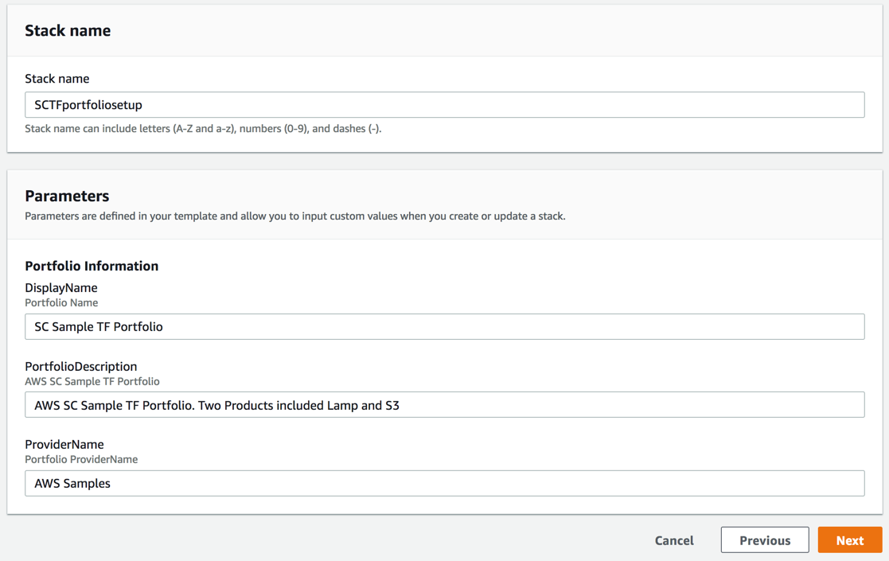
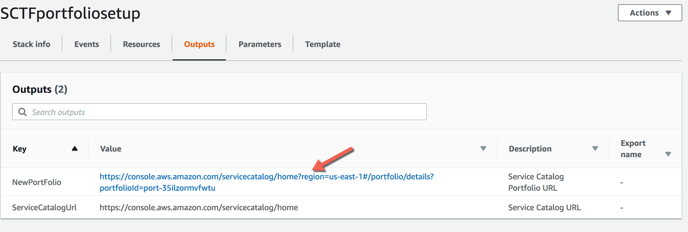
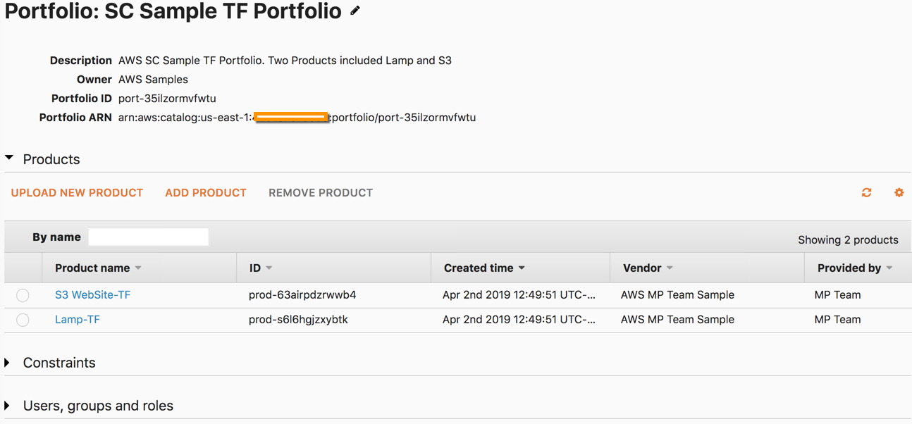

# Service Catalog Terraform Reference Architecture

## Solution Overview

**AWS Service Catalog and Terraform Terminology**  
- hub or fulfillment account: The account where the Terraform server or engine will live.
- spoke account: The spoke accounts that will execute Terraform files against the Terraform engine living in the Hub account.

This solution requires that a Terraform server be deployed and available. You can use an existing Terraform server, 
or you can deploy a new Terraform server using the supplied CloudFormation templates. The supplied CloudFormation templates will 
create a new Amazon Elastic Compute Cloud (Amazon EC2) instance and install Terraform. 

You can use one Terraform server to target resources across multiple AWS accounts. For the purposes of this paper, we will name the 
AWS account where the Terraform server resides the “hub account”. Accounts that send requests to the server and contain the provisioned 
resource will be called “spoke accounts”. For the Terraform server to operate, you must create AWS Identity and Access Management (IAM) 
roles in each of the spoke accounts and create an AWS Lambda launch function in each desired region of each spoke account. 
For example, a deployment for 3 accounts that each use us-east-1 and us-east-2 regions will result in 1 Terraform server account, 
3 spoke account roles, and 6 Lambda launch functions. The hub account and region containing the Terraform server may also be a spoke 
account, in which case you must also deploy the IAM role and Lambda launch functions in the hub account and region.

The key to the solution is a CloudFormation template that acts as a proxy to Terraform. 
The CloudFormation template uses a custom resource, implemented via an AWS Lambda function to call the Terraform APIs. 
The CloudFormation template can then be customized to capture specific parameters and used to create an AWS Service Catalog product. 


  


The Terraform files are placed in an Amazon Simple Storage Service (Amazon S3) bucket that can be accessed from AWS Service Catalog 
in each of the spoke accounts. See the following figure.  

  

Once the solution is deployed, end users in each spoke account can launch AWS Service Catalog products. 
Information about which Terraform file to use, input parameters, and an IAM permission role is passed to the 
Terraform server from the CloudFormation template. The Terraform server uses this information to manage AWS resources 
in the originating spoke account. The outputs of the Terraform server are stored in the Amazon S3 Output State Files bucket. 
The end user has access to this bucket via the AWS Service Catalog GUI or API.  

---
## Installation  

### Copy the Service Catalog Terraform components to a S3 bucket.
There are two methods for copying files to S3 
- AWS S3 Console
- AWS Command Line Interface (CLI)  

#### AWS S3 Console

##### Prep
- Open file Explorer to the top directory of your local git repo
-   
Leve it open, we will use it in a moment


1. Sign in to the AWS Console and navigate to the S3 console. https://s3.console.aws.amazon.com/s3/home
2. Verify the region. 
3. Choose the **+Create bucket** button.
4. Enter scterraform-[YOUR-ACCOUNT-ID] for the **Bucket Name**
5. Choose **Next**
6. On the **Properties** page choose **Next**
7. On the **Set permissions** page choose **Next**
8. On the **Review** page choose  **Create Bucket** 
9. Choose the **scterraform-[YOUR-ACCOUNT-ID]** 
10. Choose the **Upload** button

11.use the file explorer opened earlier to drag over the following folders
- TerraformScripts
- TerraformCustomResourceHandler
12.Choose **Upload**

#### AWS CLI

AWS CLI Install [Instructions](https://docs.aws.amazon.com/cli/latest/userguide/cli-chap-install.html)

1.  Create a S3 bucket to host the installation content  
``` aws s3 mb s3://scterraform-[YOUR-ACCOUNT-ID] ```  

2.  Copy the following files to the bucket maintaining the file structure:
    ```
     aws s3 sync ./TerraformCustomResourceHandler/bin/ s3://scterraform-[YOUR-ACCOUNT-ID]/TerraformCustomResourceHandler/bin/  
      aws s3 sync ./ServiceCatalogSamples/ s3://scterraform-[YOUR-ACCOUNT-ID]/TerraformCustomResourceHandler/bin/  
      
     aws s3 sync ./TerraformScripts/ s3://scterraform-[YOUR-ACCOUNT-ID]/ServiceCatalogSamples/  
    ```  


You now have all the files needed for launch in the S3 Bucket which has the same file structure as this github repo:  

    S3 Bukcet: scterraform-[YOUR-ACCOUNT-ID]  
    ├── TerraformScripts/  
    │   ├── cloudformation-templates/  
    │   │   ├── terraform-architecture-single-account.yaml  
    │   │   ├── terraform-fulfillment-server.yaml  
    │   │   ├── terraform-launch-lambda.yaml  
    │   │   └── terraform-spoke-principals.yaml  
    │   └── bin/  
    │       └── sc_terraform_wrapper-1.2-py3-none-any.whl  
    └── TerraformCustomResourceHandler/  
        └── bin/  
            └── aws-servicecatalog-terraform-wrapper.jar  


 ### Installing the Service Catalog Terraform reference architecture into a single account hub account  
  1. In the S3 Console, choose the **TerraformScripts/cloudformation-templates/terraform-architecture-single-account.yaml** file and copy the URL which should be simillar to this:  
  ``` https://s3.amazonaws.com/scterraform-[YOUR-ACCOUNT-ID]/TerraformScripts/cloudformation-templates/terraform-architecture-single-account.yaml ```
  2. Navigate to the CloudFormation [console](https://console.aws.amazon.com/cloudformation/).
  3. Verify the region. 
  4. Choose **Create Stack**.
  5. Under Choose a template, select Specify an **Amazon S3 template URL**.
  6. Paste the URL you copied from step 1 above  
  7. Choose **Next**.
  8. For Stack name, type **TerraformArchitecture-SingleAccount**.
  9. Leave all the parameters as defaults.
  10.  Choose **Next**
  11. On the **Configure stack options** page chose **Next**
  12. On the **Review** page
  - choose the check box for **I acknowledge that AWS CloudFormation might create IAM resources with custom names.**
  - choose the check box for **I acknowledge that AWS CloudFormation might require the following capability: CAPABILITY_AUTO_EXPAND.** and choose **Create Stack**
  

  When the Status changes to **CREATE_COMPLETE** once the stack is created. 
  The stack output will look similar to the image below.



## Create AWS Service Catalog portfolio and product based on Terraform
 
1. Navigate to the S3 [console](https://console.aws.amazon.com/s3/).
2. Choose the **terraform-config-[YOUR-ACCOUNT-ID]** bucket
3. Choose **Upload**
4. use the file explorer opened earlier to open the **ServiceCatalogSamples** folder
5. Select and drag over the following files
- sc-sample-lamp.json
- sc-sample-lamp.tf
- sc-sample-port-product-setup.json
- sc-sample-S3.json
- sc-sample-S3.tf
6. Choose **Upload**
7. In the S3 Console, choose the **sc-sample-port-product-setup.json** file
8. Righ click and Copy the URL
6.  Navigate to the **CloudFormation console** https://console.aws.amazon.com/cloudformation/
7.  Verify the **region**. 
8.  Choose **Create Stack**.
9.  Under Choose a template, select Specify an Amazon S3 template URL.
10.  Paste the URL you copied in the step above. 
12.  For Stack name, type **SCTFportfoliosetup**.
13.  For all the other parameters use the defaults.
14. Choose **Next**.
15. Choose **Create** to create the Service Catalog Sample Terraform Portfolio.
16. When the stack is complete, choose the **Outputs** tab
17. Choose the **NewPortFolio** to complete the setup and launch the sample products.





Service Catalog Console


### Congratulations, You have completed setting up the Service Catalog Terraform Refrence Archticture components in a single accounnt.

---
## Set up the spoke accounts

  For each spoke account, you’ll need to enable communication with the hub account by creating an executing role with a 
  trust relationship back to the hub account. Then, create a Lambda launch function in each desired region within the spoke account. 
  Finally, add each spoke account to the SNS topic that queues requests for the spoke account. 
  The supplied CloudFormation stacks will provision these roles and Lambda functions.
  
### Create the spoke account Terraform roles

**Note:** Make sure the TerraformWrapperServer CloudFormation stack has a status of CREATE_COMPLETE before proceeding.   

1.  Sign in to the AWS Console using the spoke account.
2.  Navigate to the CloudFormation console https://console.aws.amazon.com/cloudformation/
3.  Verify the region. 
4.  Choose Create Stack.
5.  Under Choose a template, select Specify an Amazon S3 template URL.
6.  Type the following URL  https://s3.amazonaws.com/scterraform-[YOUR-ACCOUNT-ID]/TerraformScripts/cloudformation-templates/terraform-spoke-principals.yaml
7.  Choose Next.
8.  For Stack name, type TerraformLaunchRole.
9.  For Fulfillment Account ID, type the hub account ID.
10. For FulfillmentRegion enter the region.
11. Update the remaining parameters (optional).
12. Choose Next.
13. Choose Create to create the Terraform instance.

The Status changes to CREATE_COMPLETE once the stack is created.

## Create the Terraform Lambda launch function in the regions you plan to use

**Note:** Make sure the TerraformLaunchRole CloudFormation stack has a status of CREATE_COMPLETE before proceeding. 
1.  Sign in to the AWS Console using the spoke account.
2.   Navigate to the CloudFormation console.
https://console.aws.amazon.com/cloudformation/
3.  Verify the region. 
4.  Choose **Create Stack.**
5.  Under Choose a template, select Specify an Amazon S3 template URL.
6.  Type the following URL:https://s3.amazonaws.com/scterraform-[YOUR-ACCOUNT-ID]/TerraformScripts/cloudformation-templates/terraform-launch-lambda.yaml
7.  Choose **Next**
8.  For **Stack name,** type **TerraformLaunchLambda.** 
9.  For **Fulfillment Account** ID** type the hub account ID.
10. For **FulfillmentRegion**  enter the region
11. Update the remaining parameters (optional).
12. Choose **Next.**
13. Choose **Next.**
14. Choose **Create** to create the Terraform instance.

The Status changes to CREATE_COMPLETE once the stack is created.

---
## Using the AWS Service Catalog Terraform Reference Architecture with GitHub

This section is intended for users with a basic working knowledge of GitHub. For more information on GitHub, see https://developer.github.com/v3/guides/. 
To use the Terraform Reference Architecture with GitHub, follow these steps.  
1.  Create a MachineUser with access to the repositories you would like to reference: https://developer.github.com/v3/guides/managing-deploy-keys/#machine-users  

2.  Create a secret in your hub account that contains your MachineUser's private key. For example:  
    ```
    aws secretsmanager create-secret --secret-string "`cat id_rsa`" --name TerraformMachineUserIdentity
    ```  
    For more information, see https://docs.aws.amazon.com/secretsmanager/latest/userguide/manage_create-basic-secret.html  

3.  Generate a hashed known_hosts file containing the public keys of your repository's host:  
    a.  Retrieve Github's public key using the following commands:  
    ```
    touch known_hosts
    chmod 600 known_hosts
    ssh-keyscan -t rsa github.com >> known_hosts
    ```
    b.  Verify the public key against Github's public key fingerprints using the following command:  
    ```cat known_hosts | ssh-keygen -lf -```  
    c.  Compare the output to the public key fingerprints Github has posted: https://help.github.com/articles/github-s-ssh-key-fingerprints/  
    d.  Generate a hashed known_hosts file using the public key:  
    ```ssh-keygen -H -f known_hosts```  

4.  Create a secret in your hub account that contains the hashed known_hosts file. For example:  
  ```aws secretsmanager create-secret --secret-string "`cat known_hosts`" --name TerraformKnownHosts```  

5.  Update the SshIdentitySecret and SshKnownHostsSecret parameters of your TerraformWrapperServer stack. For example:  
    ```
    aws cloudformation update-stack --template-url https://s3.amazonaws.com/scterraform-[YOUR-ACCOUNT-ID]/TerraformScripts/cloudformation-templates//terraform-fulfillment-server.yaml --parameters ParameterKey=SshKnownHostsSecret,ParameterValue=TerraformKnownHosts ParameterKey=SshIdentitySecret,ParameterValue=TerraformMachineUserIdentity --capabilities CAPABILITY_NAMED_IAM --stack-name TerraformWrapperServer
    ```
